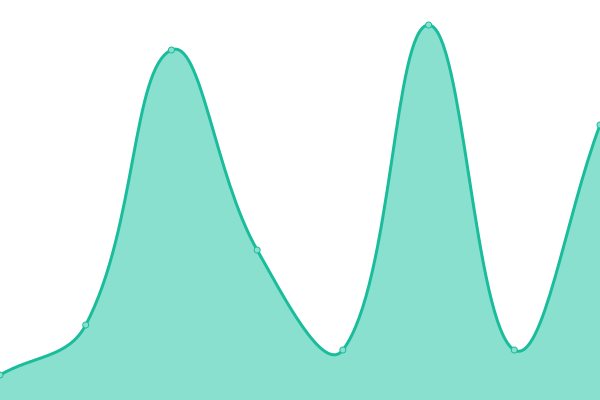
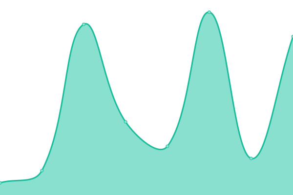

# [📈 Live Status](https://chintan9.github.io/MyDNS): <!--live status--> **🟩 All systems operational**

This repository contains the open-source uptime monitor and status page for [Upptime](https://upptime.js.org), powered by [Upptime](https://github.com/upptime/upptime).

With [Upptime](https://upptime.js.org), you can get your own unlimited and free uptime monitor and status page, powered entirely by a GitHub repository. We use [Issues](https://github.com/upptime/upptime/issues) as incident reports, [Actions](https://github.com/chintan9/MyDNS/actions) as uptime monitors, and [Pages](https://demo.upptime.js.org) for the status page.

<!--start: status pages-->
<!-- This summary is generated by Upptime (https://github.com/upptime/upptime) -->
<!-- Do not edit this manually, your changes will be overwritten -->
<!-- prettier-ignore -->
| URL | Status | History | Response Time | Uptime |
| --- | ------ | ------- | ------------- | ------ |
|  [MyDNS](https://dnsc9.dynv6.net/login.html) | 🟩 Up | [my-dns.yml](https://github.com/chintan9/MyDNS/commits/HEAD/history/my-dns.yml) | 

 307ms
     
 | 

<a href="https://chintan9.github.io/MyDNS/history/my-dns">27.87%</a>
    

|  [CloudFlare DNS 1](1.1.1.1) | 🟩 Up | [cloud-flare-dns-1.yml](https://github.com/chintan9/MyDNS/commits/HEAD/history/cloud-flare-dns-1.yml) | 

 7ms
     
 | 

<a href="https://chintan9.github.io/MyDNS/history/cloud-flare-dns-1">100.00%</a>
    

|  [CloudFlare DNS 2](1.0.0.1) | 🟩 Up | [cloud-flare-dns-2.yml](https://github.com/chintan9/MyDNS/commits/HEAD/history/cloud-flare-dns-2.yml) | 

 7ms
     
 | 

<a href="https://chintan9.github.io/MyDNS/history/cloud-flare-dns-2">100.00%</a>
    

<!--end: status pages-->

[**Visit our status website →**](https://chintan9.github.io/MyDNS)

## 📄 License

- Powered by: [Upptime](https://github.com/upptime/upptime)
- Code: [MIT](./LICENSE) © [Upptime](https://upptime.js.org)
- Data in the `./history` directory: [Open Database License](https://opendatacommons.org/licenses/odbl/1-0/)
